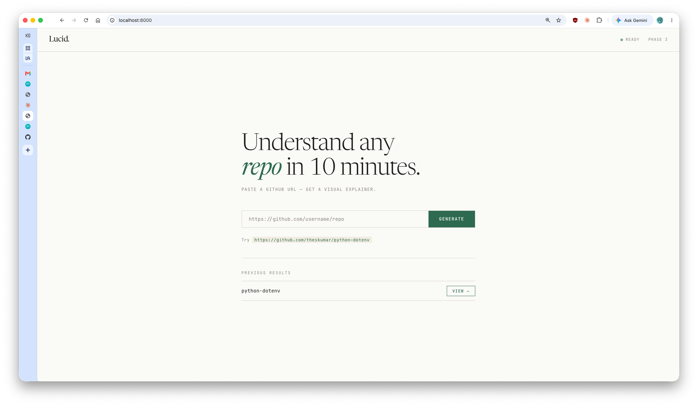
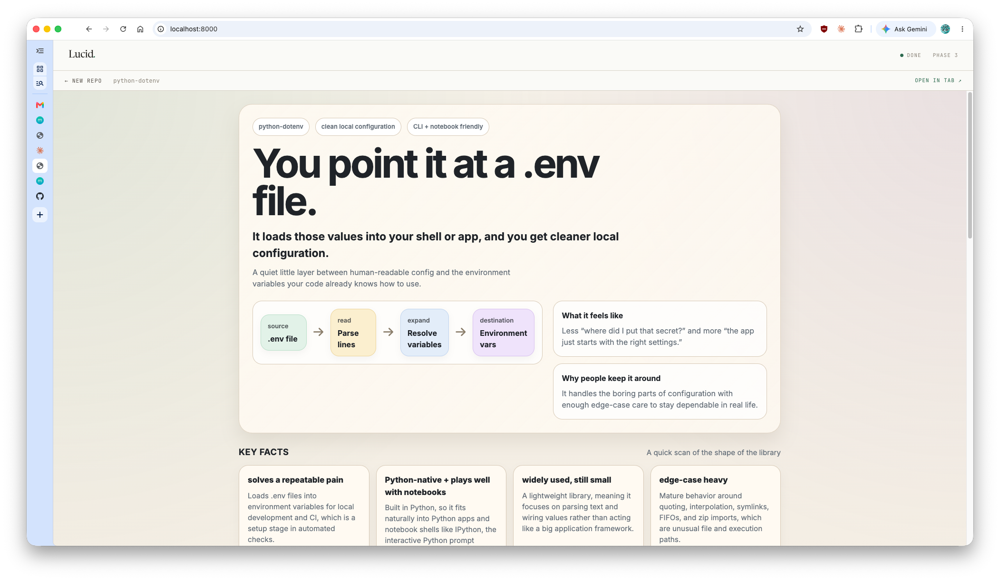
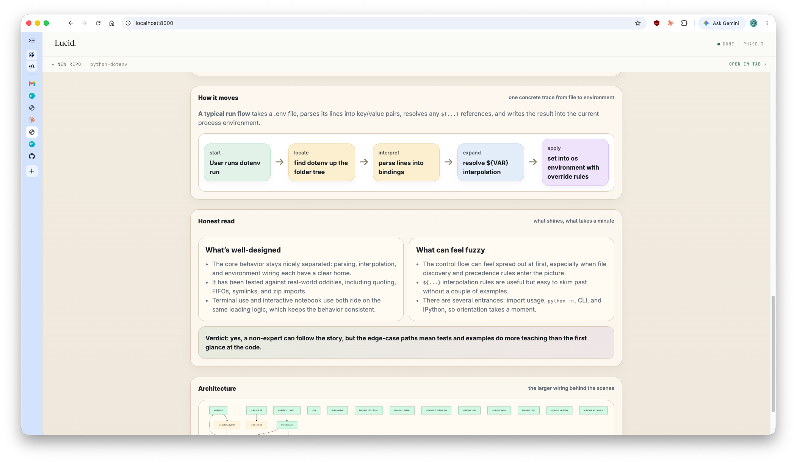

# Lucid

> You paste a GitHub URL. Lucid reads the code and writes the page. You get a visual explainer anyone can understand.

*An AI documentation generator — built in public.*

---



---

## What you'd see

Here's what Lucid produced for [python-dotenv](https://github.com/theskumar/python-dotenv) — a small Python library that manages `.env` configuration files.



*The pitch, flow diagram, and key facts — generated and designed by the AI for this specific library.*



*"How it moves" trace, "Honest read" verdict, and architecture diagram — lower on the same page.*

Every generated page has five sections:

- **Pitch + Flow** — one sentence naming the magic, followed by a 4-step diagram of how data moves through the system
- **Key Facts** — a quick grid: what problem it solves, what language, how big, who uses it
- **The Pieces** — what the main components do, in plain English (not every file — every meaningful *role*)
- **How It Moves** — one concrete trace from input to output, shown as a visual flow
- **The Honest Read** — what's well-designed, what's confusing, and a plain verdict

---

## Why I'm building this

Most documentation tools produce one type of documentation, badly. Sphinx gives you a reference index (cold facts, lookup-style). readme-ai gives you a tutorial stub. What neither does is answer all four questions a reader might have depending on where they're at:

| When you're... | You're asking... | What answers it |
|---|---|---|
| Learning for the first time | "Help me get started" | Tutorial |
| Trying to do a specific thing | "Help me do X" | How-to |
| Looking something up | "What exactly is X?" | Reference |
| Curious about the design | "Why does this work this way?" | Explanation |

These four modes come from [Diataxis](https://diataxis.fr/) — a framework for technical writing. Stripe's documentation is the gold standard: it covers all four modes, which is why it *feels* so good to read. No tool currently generates all four for an arbitrary GitHub repo. That's the gap Lucid is trying to close.

There's also a personal dimension to this. It's Phase 1 of a decade arc — a long-term project toward a Staff/Principal Document Engineer role I want to reach in ten years. The doctrine is simple: *ship a janky V1 and spend months fixing it in public.* The janky V1 is alive. The fixing-in-public has started.

---

## Where it is right now

- **End-to-end working** — paste a URL, wait ~30 seconds, get a designed HTML page in the browser
- **4 LLM calls per repo** — three calls produce structured content (pitch, piece map, honest read); the fourth is the **HTML Intelligence Engine**, which designs the entire page from scratch to match the repo's personality — no fixed template
- **Python repos only** for now — the AST analysis is Python-specific; other languages are on the roadmap
- **Web UI + terminal CLI** both working

Phase 3e shipped this week. Still a draft — output quality varies by repo. That's the experiment.

---

## Try it yourself

Needs Python 3.10+ and an OpenAI API key.

```bash
git clone https://github.com/aayushnamdev/Lucid-doc-AI.git
cd Lucid-doc-AI
python3 -m venv .venv && source .venv/bin/activate
pip install -r requirements.txt

cp .env.example .env
# open .env and set OPENAI_API_KEY=sk-...

python cli.py https://github.com/theskumar/python-dotenv
# opens output/python-dotenv/index.html when done
```

Or use the web UI:

```bash
uvicorn server:app --reload
# open http://localhost:8000
```

---

## What's next

- ✅ Phase 3e — web UI, iframe result view, HTML served directly from the browser
- ✅ HTML Intelligence Engine — per-repo page design, no fixed template
- 🟡 Cross-repo quality pass — running on `click`, `rich`, `tqdm` to check consistency
- ⬜ Phase 4 — diff-based incremental updates (only regenerate what changed)
- ⬜ Phase 5 — run on a real open-source project, submit the result as a PR
- ⬜ Blog post — "I ran an AI doc generator on 20 repos. Here's what it understood and what it missed."

---

*Built in public by [Aayush](https://github.com/aayushnamdev). Following along is the point.*
